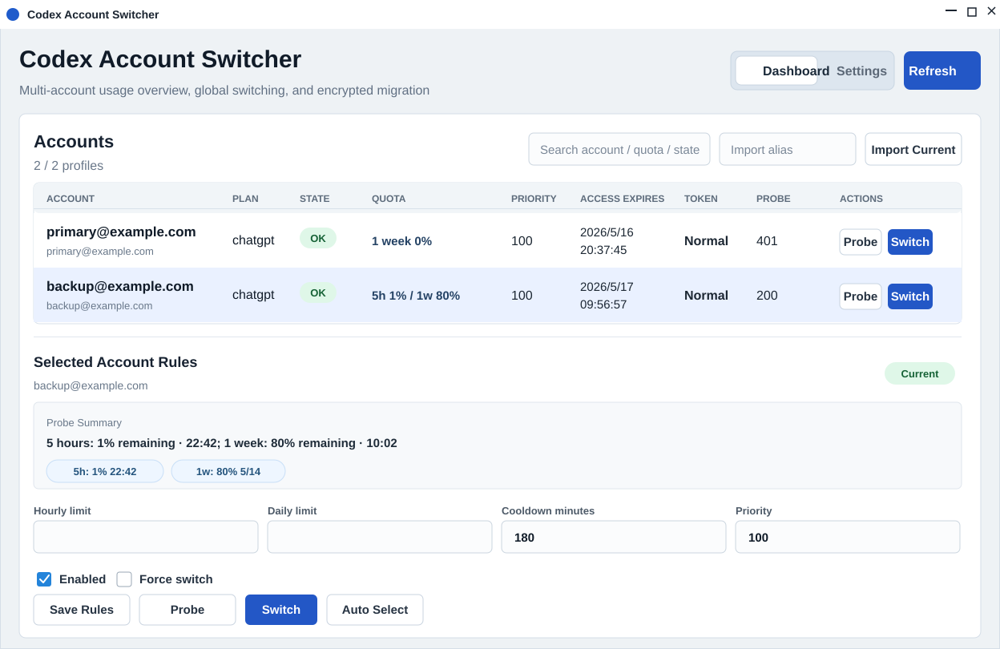

# Codex 多账号切换器

Codex 多账号切换器是一个 Tauri v2 桌面工具，用来管理多个 Codex / ChatGPT 账号 profile。它可以导入当前 `~/.codex/auth.json`，保存为本地加密 profile，探测额度，切换全局 Codex 授权文件，并把所有账号信息迁移到另一台电脑。

[English README](README.md)

> 本工具只管理你自己有权使用的账号文件。不做自动登录、不绕过验证码、不绕过平台限制。

## 功能截图



## 主要功能

- 管理多个账号 profile：别名、启用状态、优先级、冷却时间和限额规则。
- 探测 Codex / ChatGPT 额度，调用 `https://chatgpt.com/backend-api/wham/usage`。
- 支持 HTTP / SOCKS 代理，探测相关接口可以走代理。
- 切换全局 `~/.codex/auth.json`，切换前自动备份并锁定 `.codex` 目录。
- 检测 Codex 是否正在运行，避免切换账号时影响当前会话。
- 当前正在使用的账号 token 交给 Codex 自己刷新，避免 refresh token 冲突。
- 一键迁移所有账号、规则、应用设置和指定 `.codex` 配置文件。
- 可选迁移对话记录：`sessions/`、`session_index.jsonl`、`logs_2.sqlite*`、`state_5.sqlite*`。
- 支持系统托盘和右键快捷操作。
- 界面语言可跟随系统，也可手动选择简体中文、English、繁體中文。
- GitHub Actions 自动构建 Windows、macOS、Linux 版本。

## 安全说明

本地账号 profile 存在应用数据目录里。每个 profile 内包含一个加密后的账号 `auth.json` 快照。

Windows 默认路径：

```text
C:\Users\<你>\AppData\Roaming\local.codex.account-switcher\
```

重要文件：

- `store.json`：应用设置、profile 元数据、额度状态、加密账号快照、操作记录。
- `local-profile.key`：本机兜底密钥，仅在系统 keyring 不可用时使用。

迁移包支持两种模式：

- 不输入口令：导出普通 `.zip`。方便，但里面包含可读的敏感授权信息。
- 输入口令：导出加密 `.zip.enc`。口令至少 8 位。

迁移包永远不会包含这些机器绑定或沙盒文件：

- `installation_id`
- `cap_sid`
- `.sandbox/`
- `.sandbox-bin/`
- `.sandbox-secrets/`
- 临时文件和机器绑定日志

## 默认迁移内容

默认迁移：

- 所有账号 profile
- 每个账号完整的 `auth.json` 快照
- 账号别名、启用状态、优先级、冷却时间、限额规则、额度状态
- 应用设置，包括 Codex 目录、代理设置、刷新设置
- `config.toml`
- `rules/`
- `memories/`

勾选“导出对话记录”后额外迁移：

- `sessions/`
- `session_index.jsonl`
- `logs_2.sqlite*`
- `state_5.sqlite*`

## 开发

环境要求：

- Node.js LTS
- Rust stable
- 对应平台的 Tauri 依赖

安装依赖：

```bash
npm install
```

开发运行：

```bash
npm run tauri -- dev
```

前端构建：

```bash
npm run build
```

运行 Rust 测试：

```bash
cd src-tauri
cargo test
```

本地打包：

```bash
npm run tauri -- build
```

打包产物位置：

```text
src-tauri/target/release/bundle/
```

## GitHub Actions 自动构建

仓库包含两个工作流：

- `.github/workflows/ci.yml`
  - 在 push、pull request、手动触发时运行前端构建和 Rust 测试。
- `.github/workflows/release.yml`
- 手动触发或推送 `codex-account-switcher-v0.1.1` 这类 tag 时运行。
  - 自动构建 Windows、Linux、macOS Apple Silicon、macOS Intel 版本。
  - tag 构建会生成 GitHub Release 草稿并上传安装包。

创建发版 tag：

```bash
git tag codex-account-switcher-v0.1.1
git push origin codex-account-switcher-v0.1.1
```

如果 Release 上传失败，通常是仓库权限问题。到 GitHub 仓库设置：

```text
Settings -> Actions -> General -> Workflow permissions -> Read and write permissions
```

## 只发布这个工具

这个目录可以作为独立 GitHub 仓库根目录发布，不需要发布父级 CMS 项目。

直接发布：

```bash
cd tools/codex-account-switcher
git init
git add .
git commit -m "Initial Codex Account Switcher release"
git branch -M main
git remote add origin git@github.com:<owner>/<repo>.git
git push -u origin main
```

也可以从父级工作区执行脚本：

```powershell
tools/codex-account-switcher/scripts/publish-to-github.ps1 `
  -RemoteUrl git@github.com:<owner>/<repo>.git
```

## 忽略的文件和目录

仓库默认忽略这些内容：

- `node_modules/`
- `dist/`
- `src-tauri/target/`
- `src-tauri/gen/`
- 日志文件：`*.log`、`npm-debug.log*`、`pnpm-debug.log*` 等
- 缓存和临时文件：`.cache/`、`.vite/`、`*.tmp`
- 本地环境文件：`.env`、`.env.*`
- 迁移包：`*.zip`、`*.zip.enc`
- 私钥或证书：`*.pem`、`*.key`、`*.p12`、`*.pfx`
- 系统和编辑器文件：`.DS_Store`、`Thumbs.db`、`.idea/`、`.vscode/`

## 注意事项

- GitHub Actions 生成的 macOS 和 Windows 包默认未签名。
- 未签名 macOS 应用首次运行时可能需要在系统设置中手动允许。
- 未签名 Windows 安装包可能触发 SmartScreen 提示。
- 当前未附带开源许可证。如果要公开授权他人使用，请补充 `LICENSE` 文件。
