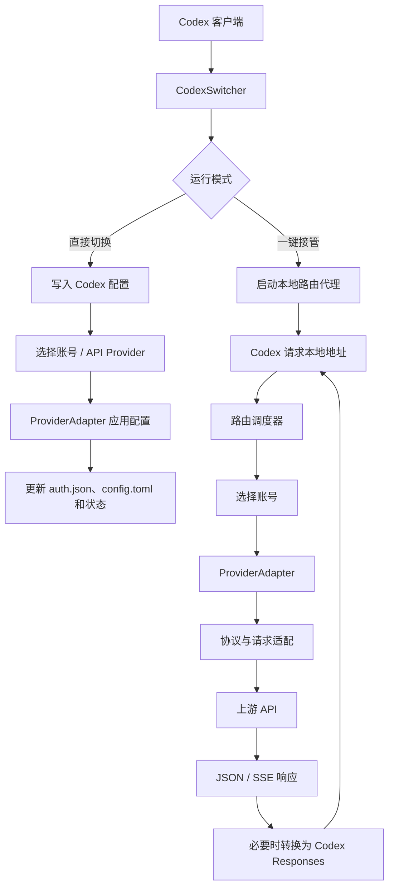
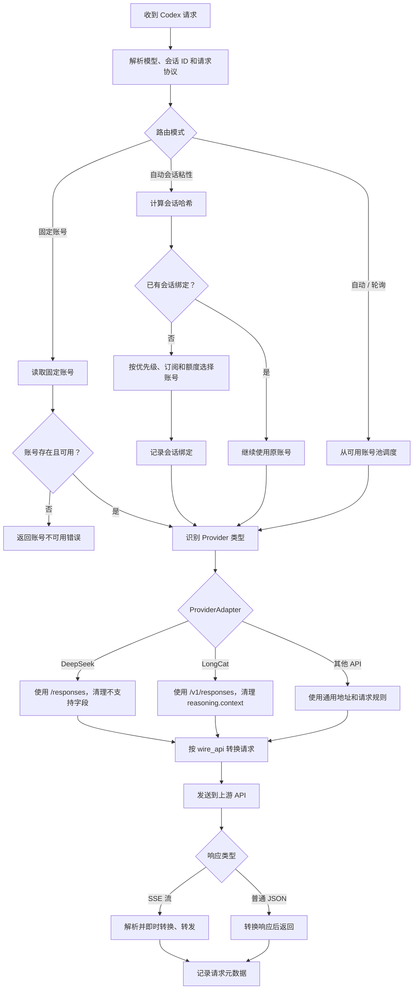

# Provider 适配与路由调度

本文记录 CodexSwitcher 在直接切换和一键接管模式下的 Provider 适配、账号调度、协议转换和流式响应流程。

## 核心原则

路由器只负责选择账号，`ProviderAdapter` 负责处理该账号对应的 API 规则：

- 路由器决定使用哪个账号、是否保持会话粘性以及何时回退。
- Provider 适配器决定上游地址、认证相关 Codex 配置和请求清理规则。
- 协议转换器负责 Responses、Chat Completions、Anthropic 之间的请求和响应转换。
- SSE 响应采用边接收、边解析、边转换、边转发的方式，不等待完整响应结束。

## 整体架构



## 请求调度流程



## 直接切换与一键接管

### 直接切换

直接切换不经过本地代理，主要修改 Codex 的本地配置：

1. 根据账号类型读取 OAuth 或 API Provider 配置。
2. 通过 `ProviderAdapter` 写入对应的 `config.toml` 选项。
3. 更新 `auth.json`、会话状态和当前 Provider 信息。
4. 启动或重新加载 Codex 后，Codex 直接请求目标 Provider。

### 一键接管

一键接管保留原始 Codex 配置备份，并把 Codex 的请求导向本地路由代理：

1. 保存当前 `auth.json`、`config.toml` 和必要的会话状态。
2. 启动本地监听地址，接收 Codex 的 Responses 请求。
3. 调度器根据路由模式选择账号。
4. 根据账号的 `provider_id`、Base URL 和模型识别 Provider 类型。
5. 由适配器构建上游地址、清理请求并应用 Provider 特性。
6. 根据 `wire_api` 转换到上游协议。
7. 上游响应实时转换后返回给 Codex。
8. 退出接管时恢复原始配置，并保留请求路由元数据。

## ProviderAdapter 关系

```mermaid
classDiagram
    class Routing {
        路由模式
        选择账号
        会话粘性
        失败回退
    }

    class ProviderAdapter {
        build_url()
        prepare_responses_request()
        apply_codex_options()
    }

    class DeepSeekAdapter {
        原生 /responses
        清理 reasoning 历史字段
        写入 apikey 模式
    }

    class LongCatAdapter {
        /v1/responses
        清理 reasoning.context
        写入 LongCat 专属选项
    }

    class GenericAdapter {
        通用 /v1/{endpoint}
        清理旧 Provider 选项
    }

    class ProtocolConverter {
        Responses
        Chat Completions
        Anthropic
        SSE 转换
    }

    Routing --> ProviderAdapter
    ProviderAdapter <|-- DeepSeekAdapter
    ProviderAdapter <|-- LongCatAdapter
    ProviderAdapter <|-- GenericAdapter
    Routing --> ProtocolConverter
```

### 当前适配规则

| Provider | 上游地址规则 | 请求处理 | Codex 配置处理 |
| --- | --- | --- | --- |
| DeepSeek | 官方根地址使用 `/responses` | 清理不支持的 `reasoning.context`、`summary` 和 `encrypted_content` | 使用 API Key 模式，默认高推理强度 |
| LongCat | 根地址使用 `/v1/responses` | 清理 `reasoning.context` | 写入 LongCat 所需的响应存储、搜索和推理选项 |
| Generic | 根地址使用 `/v1/{endpoint}` | 保留通用请求结构 | 清理已知的 Provider 专属旧选项 |

Provider 类型按 `provider_id`、Base URL 和模型名综合识别，优先识别 LongCat 和 DeepSeek，避免仅依赖模型名称造成误判。

## 协议与流式处理

Codex 对本地路由统一使用 Responses 入口。若账号配置的 `wire_api` 不同，处理链路如下：

```text
Codex Responses 请求
    -> 请求清理
    -> Responses 转 Chat Completions / Anthropic
    -> 上游 API
    -> Chat Completions / Anthropic 响应
    -> Responses 响应和 SSE 事件
    -> Codex
```

流式请求不会先缓存完整响应。路由器会持续读取上游字节，按 SSE 事件边界解析，完成必要的协议转换后立即写回客户端；只有请求元数据和最终状态进入“最近请求”记录，不保存完整提示词或响应正文。

## 新增 Provider 的扩展方式

新增 Provider 时不需要修改主路由调度流程，按以下步骤扩展：

1. 在 `provider_compat.rs` 增加 Provider 类型和适配器。
2. 实现上游 URL 构建规则。
3. 实现请求字段清理或 Provider 特殊参数转换。
4. 实现直接切换时需要写入的 Codex 配置。
5. 在协议转换器中补充 Chat、Responses 或 Anthropic 适配（如果上游不是 Responses）。
6. 增加 URL、请求清理、配置切换和 SSE 回归测试。

这样直接切换和一键接管会自动共享同一套 Provider 行为，避免两个入口出现不同的账号类型处理逻辑。
